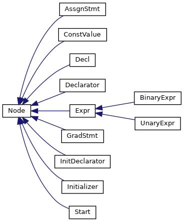

# Nabla


<br>

Nabla is a Domain specific langauge built for the purpose of Tensor Operations and Automatic differentiation
<br>
It uses dynamically built computational graphs for back-propagation.
Take a look at the code below

```python
{
var Tensor a[2][2]  = [[2.0, 3.0],[4.0, 5.0]];
var Tensor b[2][1]  = [3, 1];
var Tensor c[2][1]  = [4,6];
var Tensor z[2][1];
cns float d = 6.5;
var float m = 7.0;
z = a@b + c;
print(z);
cns int k  = 5;
cns int z = k >> 1;
if(k > 0 || a[0][1]){  
        c  = a + b;
        if(b >= 0){
            b  = b*25;
        }
        endif
}
elif(k < 0){
        c = a - b;
}
else{
        c = a;
}
endif

loop(int i = 0; i< 10; i++){
    c = c + a;
}
float k = 1.0; 
var Tensor x[2][2]  = [[2.0, 3.0],[4.0, 5.0]];
var Tensor y[2][1]  = [5.0 , 6.0];
var Tensor p [2][1];
var Tensor Final[2][1];
p = m*x@y;
Final = cos(p + z);
backward(Final);
print(grad(a));
print(grad(m));
}
```

The code will be converted into a computational graph(internally) of the form:-
After this we will be able to use the chain rule to calculate the gradients of the Final variable in terms of the beginning variables


## The Class Hierarchy

---




## Testing The Lexer

---

Run the Following commands to test the Lexer,
```console
cd Lexer
make test
```
If you wish to see the outputs of the Lexer File, Please look into  `Lexer/Test/*.test-exp` 
To run the parser and the Lexer jointly please use the following commands 

```bash
yacc -d Parser/grammar.y && lex Lexer/lexer.l && gcc lex.yy.c y.tab.c -o exec 
./exec < Parser/Test/tmp.txt   
```